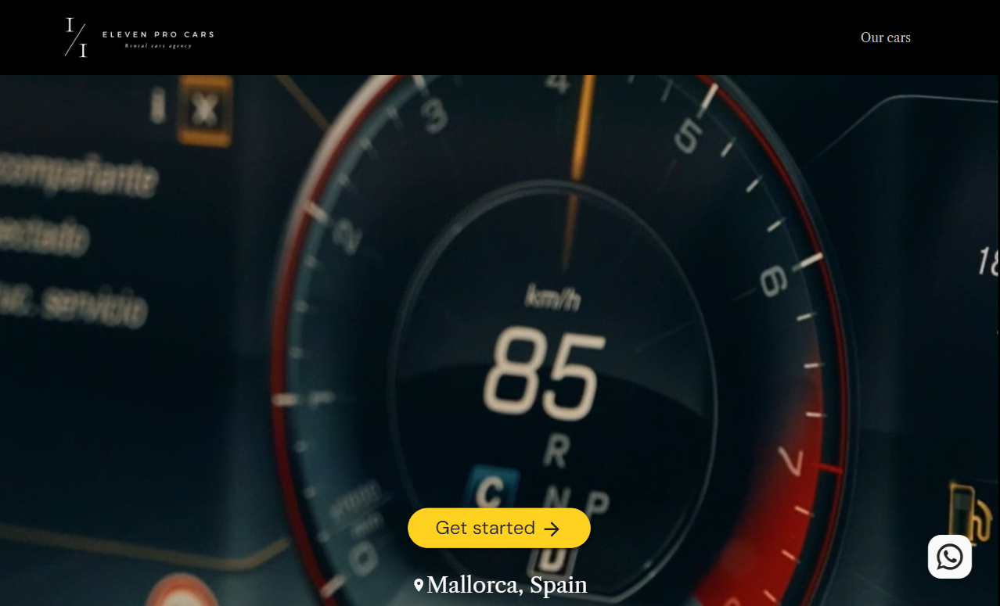

# Eleven Pro Cars

**Descripción del proyecto:** Plataforma web para una concesionaria de autos que permite a los usuarios explorar, comparar y solicitar pruebas de manejo de vehículos de alta gama.

**Mi rol en el proyecto:** Desarrolladora Frontend, encargada de la implementación de interfaces interactivas y responsivas usando **React.js**, así como la integración con **Firebase** para la gestión de datos en tiempo real y autenticación de usuarios.

<h3>👉🏻 <b>Deploy: <a href="https://elevenprocar.com" target="_blank">ELEVEN PRO CARS</a></b></h3>

---

## Tecnologías utilizadas:
- 
- 
- 
- 
- 
- 